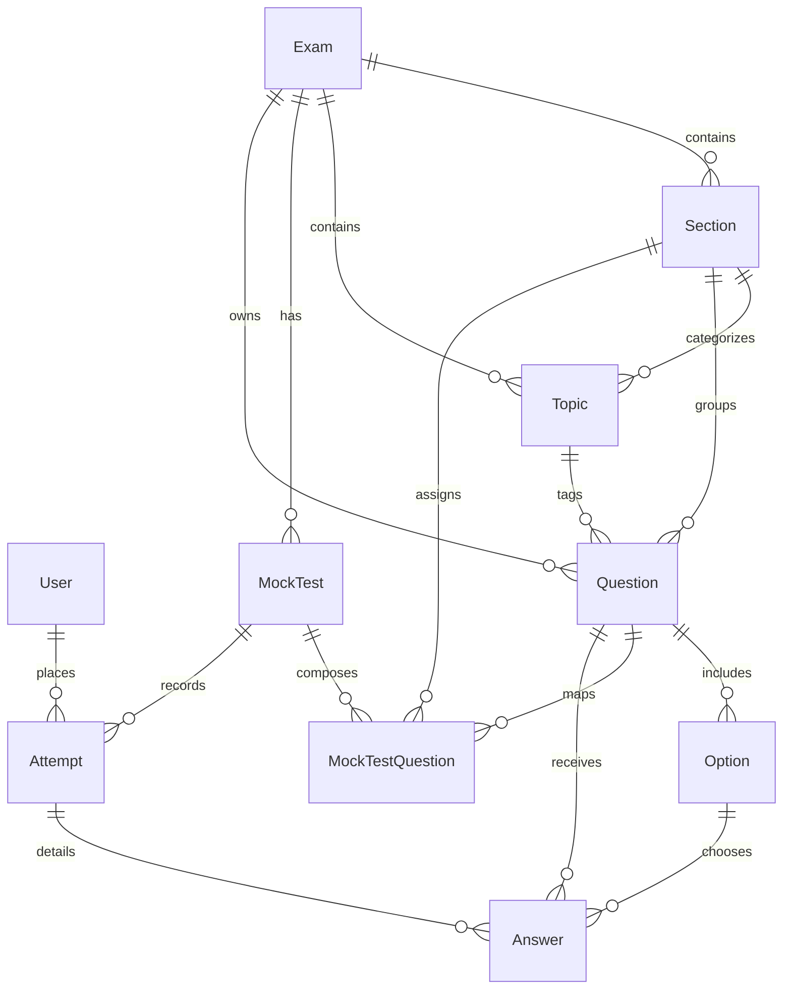

# BankMock: Master Architecture & Domain Specification

> **Notice for AI Coding Agents & Engineers**:  
> This file is the single, authoritative architectural, domain, and codebase reference for **BankMock**. It provides deep context on banking recruitment examination patterns, CBT player mechanics, dual-layer question storage, deduplication systems, and Next.js 16 platform internals. **Consult this document to understand the codebase without performing token-heavy repo-wide scans.**

---

## 1. System Mission & Banking Examination Domain Rules

BankMock is an enterprise-grade Computer-Based Testing (CBT) platform replicating official Indian banking recruitment examinations conducted by IBPS (Institute of Banking Personnel Selection) and SBI (State Bank of India).

### 1.1 Supported Examinations & Tiers
- **IBPS PO (Probationary Officers)**: Prelims and Mains (includes descriptive and General/Banking Awareness).
- **SBI Clerk (Junior Associates)**: Prelims and Mains.
- **SBI PO**: High-difficulty analytical Prelims and Mains.

### 1.2 Official Prelims CBT Pattern (Strict Standards)
- **Total Questions**: 100 Questions.
- **Total Marks**: 100.0 Marks.
- **Total Duration**: 60 Minutes (3600 seconds).
- **Three Locked Sections**:
  1. **English Language**: 30 Questions, 30 Marks, **20 Minutes (1200s)**.
  2. **Quantitative Aptitude**: 35 Questions, 35 Marks, **20 Minutes (1200s)**.
  3. **Reasoning Ability**: 35 Questions, 35 Marks, **20 Minutes (1200s)**.

### 1.3 Strict Sectional Timing Lock Invariant
Official banking exams enforce **sectional time limits**. In BankMock:
- Candidates are strictly locked into the active section for exactly 20 minutes.
- Candidates **cannot** switch ahead or navigate to questions belonging to another section while a section is active.
- When the 20-minute countdown reaches zero:
  1. The section permanently locks (`lockedSectionCodes`).
  2. The candidate cannot revisit questions in that section.
  3. The player displays the `SectionTransitionModal` and auto-advances to the next section.
  4. Once the final section expires, the test is automatically submitted.

### 1.4 Marking Scheme & Scoring Invariants
- **Correct Answer**: `+1.0` mark (or custom question marks, e.g., `+2.0` in certain Mains questions).
- **Incorrect Answer (Penalty)**: `-0.25` mark (exact 25% negative marking penalty).
- **Unanswered / Marked for Review without Option**: `0.0` mark.
- **Accuracy %**: `(correctCount / totalAttempted) * 100`.
- **Cutoffs**: Evaluates both sectional cutoffs (`isCutoffCleared` per section) and aggregate exam cutoff.

---

## 2. Core Architectural Patterns & Hybrid Data Strategy

BankMock employs a hybrid data architecture combining pre-bundled historical exam papers with serverless cloud persistence for dynamic operations.

```
┌────────────────────────────────────────────────────────────────────────┐
│                          Next.js 16 App Router                         │
├──────────────────────────────────┬─────────────────────────────────────┤
│      Edge Proxy Middleware       │        Server Actions & APIs        │
│           (proxy.ts)             │       (lib/services/*.ts)           │
└─────────────────┬────────────────┴──────────────────┬──────────────────┘
                  │                                   │
                  ▼                                   ▼
    ┌───────────────────────────┐       ┌───────────────────────────────┐
    │     Cryptographic Auth    │       │     Dual Storage Engine       │
    │  Web Crypto HMAC-SHA256   │       │                               │
    │  Cookie: bankmock_session │       │  1. In-Memory Static Store    │
    └───────────────────────────┘       │     (data/*.json, 450+ PYQs)  │
                                        │  2. Neon Cloud PostgreSQL     │
                                        │     (Prisma ORM 6.19)         │
                                        └───────────────────────────────┘
```

### 2.1 Next.js 16 Platform Standards (`AGENTS.md`)
- **Proxy Middleware**: Uses `proxy.ts` (Next.js 16 proxy middleware export convention) rather than legacy `middleware.ts`.
- **Async Route Parameters**: Dynamic segment `params` in page components are typed as `Promise<{ paramName: string }>` and unwrapped using React's `use(params)`.
- **Server Actions**: Mutations reside in server action files marked `'use server'`, invoked directly from React 19 client components via `useTransition()`.
- **Script Override**: CLI verification scripts bypass HTTP cookie guards by setting `process.env.ADMIN_OVERRIDE = 'true'`.

### 2.2 Dual-Layer Storage Strategy
1. **Benchmark Static Store (`data/*.json` & `lib/db/questionDb.ts`)**:
   - Bundles authentic PYQ papers: `questions.json`, `sbi_clerk_2024_pyq.json`, `ibps_po_2024_prelims_pyq.json`, `ibps_po_2023_prelims_pyq.json`, and `ibps_po_2025_mains_pyq.json`.
   - Initialized into in-memory store `questionStore` with deterministic deduplication by ID.
   - Provides zero-latency test generation, shuffling, and fallback when cloud database is unavailable.
2. **Neon Serverless PostgreSQL Database (`prisma/schema.prisma`)**:
   - Manages dynamic state: live user accounts, pending approvals, candidate exam attempts, individual question answers, custom mock tests, and newly authored admin questions.
   - Accessed through singleton `prisma` client (`lib/prisma.ts`).

---

## 3. Complete Database Schema (Prisma ORM)

The relational schema in `prisma/schema.prisma` is optimized for test delivery, auditability, and clean cascading deletion.

### 3.1 Entity Relationship Diagram



### 3.2 Schema Models Breakdown

#### `User`
- `id` (UUID, Primary Key)
- `email` (String, Unique)
- `name` (String)
- `password` (String, hashed / nullable for OAuth)
- `role` (`Role` enum: `USER`, `ADMIN`)
- `status` (`UserStatus` enum: `PENDING`, `APPROVED`, `REJECTED`)
- `createdAt`, `updatedAt` (DateTime)

#### `Exam`
- `id` (UUID, Primary Key)
- `slug` (String, Unique, e.g. `ibps-po`, `sbi-clerk`)
- `title` (String, e.g. `IBPS PO Prelims Examination`)
- `category` (`ExamCategory` enum: `PO`, `CLERK`, `SO`, `OTHER`)
- `description` (String)
- `isActive` (Boolean, default `true`)

#### `Section`
- `id` (UUID, Primary Key)
- `name` (String, e.g. `Quantitative Aptitude`)
- `code` (String, e.g. `QUANT`, `REASONING`, `ENGLISH`, `FINANCIAL_AWARENESS`)
- `examId` (UUID -> `Exam.id`, `onDelete: Cascade`)
- `order` (Int, default `0`)
- **Unique Constraint**: `@@unique([examId, code])`

#### `Topic`
- `id` (UUID, Primary Key)
- `name` (String, e.g. `Data Interpretation`, `Syllogism`, `Reading Comprehension`)
- `sectionId` (UUID -> `Section.id`, `onDelete: Cascade`)

#### `Question`
- `id` (UUID, Primary Key)
- `text` (Text: question stem with LaTeX equation support)
- `imageUrl` (Text, nullable: question diagram Base64 / URL)
- `passage` (Text, nullable: shared Reading Comprehension or DI context)
- `passageImageUrl` (Text, nullable: shared DI chart Base64 / URL)
- `groupId` (String, nullable: group identifier for shared passage / DI sets)
- `isPyq` (Boolean, default `false`)
- `pyqYear` (Int, nullable: e.g. `2024`)
- `pyqExam` (String, nullable: e.g. `IBPS PO Prelims 2024`)
- `difficulty` (`Difficulty` enum: `EASY`, `MEDIUM`, `HARD`)
- `explanation` (Text: comprehensive step-by-step solution)
- `marks` (Float, default `1.0`)
- `negativeMarks` (Float, default `0.25`)
- `examId`, `sectionId`, `topicId` (Foreign Keys with `onDelete: Cascade`)

#### `Option`
- `id` (UUID, Primary Key)
- `questionId` (UUID -> `Question.id`, `onDelete: Cascade`)
- `text` (Text: option text with LaTeX support)
- `imageUrl` (Text, nullable)
- `isCorrect` (Boolean, default `false`)
- `order` (Int, default `0`)

#### `MockTest`
- `id` (UUID, Primary Key)
- `slug` (String, Unique)
- `title` (String, e.g. `IBPS PO Prelims Official Full Mock 1`)
- `description` (String)
- `examId` (UUID -> `Exam.id`, `onDelete: Cascade`)
- `durationMinutes` (Int, default `60`)
- `totalMarks` (Float, default `100.0`)
- `totalQuestions` (Int, default `100`)
- `cutoffMarks` (Float, nullable)
- `isFree` (Boolean, default `true`)
- `isPublished` (Boolean, default `true`)
- `isFixed` (Boolean, default `false`)
- `isPyq` (Boolean, default `false`)
- `year` (Int, nullable)

#### `MockTestQuestion` (Junction Table)
- `id` (UUID, Primary Key)
- `mockTestId` (UUID -> `MockTest.id`, `onDelete: Cascade`)
- `questionId` (UUID -> `Question.id`, `onDelete: Cascade`)
- `sectionId` (UUID -> `Section.id`, `onDelete: Cascade`)
- `order` (Int, default `0`)
- **Unique Constraint**: `@@unique([mockTestId, questionId])`

#### `Attempt`
- `id` (UUID, Primary Key)
- `userId` (UUID -> `User.id`, `onDelete: Cascade`)
- `mockTestId` (UUID -> `MockTest.id`, `onDelete: Cascade`)
- `startedAt`, `completedAt` (DateTime)
- `timeTakenSeconds` (Int)
- `score`, `maxScore`, `accuracy` (Float)
- `totalAttempted`, `correctCount`, `incorrectCount`, `unansweredCount` (Int)
- `isCompleted` (Boolean, default `false`)

#### `Answer`
- `id` (UUID, Primary Key)
- `attemptId` (UUID -> `Attempt.id`, `onDelete: Cascade`)
- `questionId` (UUID -> `Question.id`, `onDelete: Cascade`)
- `selectedOptionId` (UUID -> `Option.id`, `onDelete: SetNull`)
- `isMarkedForReview` (Boolean, default `false`)
- `isAnswered` (Boolean, default `false`)
- `isCorrect` (Boolean, nullable)
- `marksObtained` (Float, default `0`)
- `timeSpentSeconds` (Int, default `0`)
- **Unique Constraint**: `@@unique([attemptId, questionId])`

---

## 4. Passage & DI Image Deduplication System (`groupId`)

In official banking exams, Reading Comprehension (RC) and Data Interpretation (DI) problems present sets of 4 to 8 questions referencing a single long text passage or high-resolution chart. Storing the identical passage text (often 500+ words) or chart image across every question bloats the database.

### 4.1 Deduplication Architecture
- **In Database / CSV**: Only the **first question** of the group stores the `passage` and `passageImageUrl`. Questions 2 through $N$ store `NULL` (or empty string) for those fields while sharing the same non-empty `groupId`.
- **Storage Saving**: Eliminates 75% to 88% of redundant text and image storage.
- **Dynamic Hydration (`resolveGroupPassages`)**: Located in `lib/db/questionDb.ts`.

```typescript
export function resolveGroupPassages<T extends {
  groupId?: string | null;
  passage?: string | null;
  passageImageUrl?: string | null;
}>(questions: T[]): T[]
```

#### Hydration Algorithm
1. **Pass 1 (Group Context Mapping)**: Iterates over the candidate question batch and creates a `Map<groupId, { passage, passageImageUrl }>`. If any question in the group possesses a passage or chart, it registers as the master context.
2. **Pass 2 (In-Memory Parent Lookup)**: If an incoming question has a `groupId` whose master was not included in the immediate batch, it queries `questionStore` to recover the parent group context.
3. **Pass 3 (Hydration)**: Maps each question. If `q.groupId` exists and `q.passage` is empty, it hydrates `q.passage` and `q.passageImageUrl` from the group master.

---

## 5. Client-Side Image Compression Pipeline (`imageCompressor.ts`)

Located in `lib/utils/imageCompressor.ts`.

### 5.1 The Transparent Chart Problem
DI charts and bank reasoning diagrams are frequently transparent PNG files. If directly converted to standard JPEG without pre-processing, all transparent pixels turn pitch black, rendering black chart text and axes completely unreadable.

### 5.2 Compression Specification
- **Max Dimension**: 900 pixels (`maxDimension = 900`). Proportional scaling preserves aspect ratio.
- **Compression Quality**: 0.76 JPEG (`quality = 0.76`).
- **Canvas White Background Fill**:
  ```typescript
  // Mandatory pre-fill prevents transparent charts turning black in JPEG
  ctx.fillStyle = '#FFFFFF';
  ctx.fillRect(0, 0, width, height);
  ctx.drawImage(img, 0, 0, width, height);
  const compressedDataUrl = canvas.toDataURL('image/jpeg', quality);
  ```
- **File & Base64 Support**: Functions `compressImageFile(file)` and `compressDataUrl(dataUrl)` return `{ compressedDataUrl, originalSizeBytes, compressedSizeBytes, compressionRatioPercent, width, height }`.

---

## 6. CBT Test Player Engine & Lifecycle

Located in `app/test/[testId]/page.tsx` and accompanying components in `components/questions/`.

### 6.1 Question State Machine
Every question displays one of 5 distinct visual states in the `QuestionPalette`:
1. `NOT_VISITED` (Slate gray border): Candidate has not viewed the question yet.
2. `NOT_ANSWERED` (Crimson red): Candidate viewed the question but moved on without selecting an option.
3. `ANSWERED` (Emerald green): Candidate selected an option.
4. `MARKED_FOR_REVIEW` (Indigo / Purple): Question flagged for review without an answer.
5. `ANSWERED_AND_MARKED` (Indigo with green check badge): Question answered AND flagged for review. (Under official rules, this answer **is evaluated** for scoring).

### 6.2 20-Minute Sectional Timer Lock Engine
1. **Initialization**: Timers are populated per section: `sectionTimers[sec.code] = (sec.durationMinutes || 20) * 60`.
2. **Clock Decoupling**: Driven by a master 1-second `setInterval` in `useEffect`, decoupled from React component re-render jitter.
3. **Auto-Transition Flow**:
   - When `activeSectionRemainingSeconds <= 1`, the current section code is pushed to `lockedSectionCodes`.
   - `handleSectionTimeUp()` opens `sectionTransitionModal` displaying previous and upcoming section names.
   - Focus advances to the first question of the next unlocked section.
   - If the final section reaches zero, `executeSubmission()` auto-submits the attempt.
4. **Navigation Enforcement**: Clicking a question in `QuestionPalette` from a locked section or outside the active section is rejected (`selectQuestion` guards against non-active section clicks).

### 6.3 State Persistence & Clean Re-attempts
- **In-Progress Autosave**: Periodically serializes `{ questions, responses, visitedQuestions, sectionTimers, lockedSectionCodes, proctoringStrikes, currentSectionCode, currentQuestionId }` into `localStorage[bankmock_test_progress_${testId}]`.
- **Exit Without Submit**: Listeners on `beforeunload` and `pagehide` purge `bankmock_test_progress_${testId}` if `isSubmittedRef.current === false`. This ensures candidates returning after abandoning a test start with clean state.
- **Explicit Re-attempts**: Navigation with `?reattempt=true` or `?restart=true` triggers an immediate wipe of localStorage state and seeds a new attempt.
- **Seen Question Tracker (`userQuestionTracker.ts`)**: Caches question IDs previously served to the candidate so subsequent dynamic mock tests prioritize unseen questions.

### 6.4 Proctoring Guard (`ProctoringGuard.tsx`)
- Detects `visibilitychange` (tab switching), `blur` (window defocus), and fullscreen exit.
- Awards strikes (`maxStrikes = 3`).
- Reaching maximum strikes displays high-priority warning modal or triggers forced submission.

---

## 7. Security, Session Crypto & Route Guard Architecture (`proxy.ts`)

Authentication does not rely on third-party opaque black boxes. It uses standard Web Crypto API HMAC-SHA256 tokens compatible across Edge Runtime and Node.js.

### 7.1 Cryptographic Session Token (`lib/auth/crypto.ts`)
- **Structure**: `base64url(payload).base64url(hmacSha256Signature)`
- **Payload (`SessionPayload`)**: `{ userId, role, status, email, name, exp }`
- **Cookie Configuration**: `bankmock_session`, `HttpOnly`, `SameSite: Lax`, `Secure` in production, `Max-Age: 7 days`.

### 7.2 Strict RBAC & Route Protection Matrix (`proxy.ts`)

| Route Family | Required Authentication | Required Role | Redirection on Failure |
| :--- | :--- | :--- | :--- |
| `/admin` & `/admin/*` | Valid Session Cookie | `Role.ADMIN` | Unauthenticated: `/admin/login?callbackUrl=...`<br>Non-Admin: `/unauthorized` |
| `/admin/login` | None (Public) | Any | Authenticated Admins redirected to `/admin` |
| `/test/*` | Valid Session Cookie | Any (`USER` or `ADMIN`) | `/login?callbackUrl=...` |
| `/dashboard/*` | Valid Session Cookie | Any | `/login?callbackUrl=...` |
| `/my-results/*` | Valid Session Cookie | Any | `/login?callbackUrl=...` |
| `/result/*` | Valid Session Cookie | Any | `/login?callbackUrl=...` |
| `/review/*` | Valid Session Cookie | Any | `/login?callbackUrl=...` |
| `/profile/*` | Valid Session Cookie | Any | `/login?callbackUrl=...` |
| `/`, `/exams/*`, `/tests/*` | None (Public) | Any | Direct Access Permitted |

### 7.3 Candidate Approval Workflow
- Self-registered users default to `status: 'PENDING'`.
- Admins inspect pending users in `/admin/users`.
- Server actions `approveUserAction(userId)` and `rejectUserAction(userId)` toggle user access.
- Admins are protected by a self-demotion / self-rejection guard preventing lockouts.

---

## 8. Bulk Question Import Specification (CSV / JSON)

Administrators bulk-import questions via `/admin/questions` using the `BulkQuestionModal`.

### 8.1 Standard CSV Header Format
```csv
groupId,passage,passageImageUrl,imageUrl,sectionCode,topicName,text,optionA,optionB,optionC,optionD,optionE,correctOption,marks,negativeMarks,difficulty,explanation
```

### 8.2 Column Definitions & Invariants

| Column | Type | Required? | Accepted Values / Rules |
| :--- | :--- | :--- | :--- |
| `groupId` | String | Optional | Set identifier (e.g. `RC-SET-01`, `DI-SET-04`). Empty for standalone questions. |
| `passage` | String | Conditional | Reading Comprehension text. **Required on Question 1** of a group; leave empty `""` on questions 2–$N$. |
| `passageImageUrl` | String | Optional | Shared DI chart Base64 data URI or image URL. Provided once on Question 1. |
| `imageUrl` | String | Optional | Standalone diagram Base64 or image URL specific to this single question. |
| `sectionCode` | String | **Required** | `QUANT`, `REASONING`, `ENGLISH`, `FINANCIAL_AWARENESS`. |
| `topicName` | String | **Required** | Human-readable topic (e.g. `Reading Comprehension`, `Data Interpretation`, `Syllogism`, `Simplification`). |
| `text` | String | **Required** | Question stem. Supports KaTeX LaTeX expressions wrapped in `$...$` or `$$...$$`. |
| `optionA` to `optionE` | String | **Required** | 5 distinct options representing banking format. Supports LaTeX. |
| `correctOption` | String | **Required** | Single uppercase character: `A`, `B`, `C`, `D`, or `E`. |
| `marks` | Number | Optional | Default `1.0`. Positive score awarded. |
| `negativeMarks` | Number | Optional | Default `0.25`. Penalty subtracted on incorrect answer. |
| `difficulty` | String | Optional | `EASY`, `MEDIUM`, `HARD`. Defaults to `MEDIUM`. |
| `explanation` | String | **Required** | Step-by-step mathematical or logical solution. Supports LaTeX. |

### 8.3 KaTeX LaTeX Formatting Rules
Math expressions within questions, options, or explanations must use standard LaTeX math delimiters:
- **Inline**: `$\sqrt{625} + \frac{15}{3} \times 4 = 37$`
- **Quadratic Equations**: `$x^2 - 7x + 12 = 0 \implies (x - 3)(x - 4) = 0$`
- **Display Mode**: `$$\sum_{i=1}^{n} X_i = \bar{X} \times n$$`

### 8.4 Canonical CSV Example
```csv
groupId,passage,passageImageUrl,imageUrl,sectionCode,topicName,text,optionA,optionB,optionC,optionD,optionE,correctOption,marks,negativeMarks,difficulty,explanation
RC-SET-01,"The Reserve Bank of India (RBI) operates as the nation's central monetary authority, tasked with maintaining price stability while fostering sustainable economic growth. In response to fluctuating global inflationary pressures, the Monetary Policy Committee (MPC) meticulously regulates the policy Repo Rate and the Cash Reserve Ratio (CRR). By fine-tuning these policy tools, the central bank directly influences domestic liquidity, commercial lending trajectories, and corporate capital expenditure cycles. Financial inclusion drives and digital banking innovations further amplify the transmission of monetary policy across rural and semi-urban banking sectors.","","",ENGLISH,Reading Comprehension,"What is the primary dual mandate of the Reserve Bank of India highlighted in the passage?","Maximizing export revenue and foreign exchange","Maintaining price stability while supporting economic growth","Eliminating inter-bank lending rates completely","Providing direct subsidies to commercial institutions","None of the above",B,1,0.25,MEDIUM,"As explicitly stated in the first sentence, the RBI's dual mandate focuses on maintaining price stability while fostering sustainable economic growth."
RC-SET-01,"","","",ENGLISH,Reading Comprehension,"Which policy tool mentioned directly impacts commercial bank reserves without interest compensation?","Statutory Liquidity Ratio (SLR)","Cash Reserve Ratio (CRR)","Marginal Standing Facility (MSF)","Open Market Operations (OMO)","Reverse Repo Rate",B,1,0.25,EASY,"The passage highlights the Cash Reserve Ratio (CRR), which requires commercial banks to maintain cash balances with the central bank."
RC-SET-01,"","","",ENGLISH,Reading Comprehension,"According to the context, what role do digital banking innovations play in monetary economics?","They bypass central banking authority entirely","They amplify the transmission of monetary policy across wider sectors","They eliminate all credit risks in retail lending","They reduce corporate capital expenditures to zero","None of the above",B,1,0.25,MEDIUM,"The passage notes that digital banking innovations amplify the transmission of monetary policy across rural and semi-urban banking sectors."
RC-SET-01,"","","",ENGLISH,Reading Comprehension,"Which word from the passage is closest in meaning to 'carefully and with great attention to detail'?","Fluctuating","Meticulously","Trajectories","Transmission","Expenditure",B,1,0.25,EASY,"'Meticulously' means in a way that shows great attention to detail or very thoroughly."
DI-SET-01,"Directions (Questions 5-8): The following Data Interpretation chart displays branch manufacturing distribution across 4 quarters (Q1 to Q4). Total production stood at 2400 units: Q1 (20%), Q2 (30%), Q3 (25%), Q4 (25%). Study the information and answer the questions.","data:image/svg+xml;utf8,<svg xmlns='http://www.w3.org/2000/svg' width='600' height='260' viewBox='0 0 600 260'><rect width='100%' height='100%' fill='%23f8fafc'/><text x='300' y='32' text-anchor='middle' font-size='16' font-family='sans-serif' font-weight='bold' fill='%230f172a'>Branch Production Units (Total = 2400)</text><rect x='60' y='140' width='80' height='90' fill='%233b82f6'/><text x='100' y='130' text-anchor='middle' font-size='12' font-weight='bold' fill='%231e293b'>Q1: 480 (20%)</text><rect x='190' y='95' width='80' height='135' fill='%2310b981'/><text x='230' y='85' text-anchor='middle' font-size='12' font-weight='bold' fill='%231e293b'>Q2: 720 (30%)</text><rect x='320' y='117' width='80' height='113' fill='%23f59e0b'/><text x='360' y='107' text-anchor='middle' font-size='12' font-weight='bold' fill='%231e293b'>Q3: 600 (25%)</text><rect x='450' y='117' width='80' height='113' fill='%238b5cf6'/><text x='490' y='107' text-anchor='middle' font-size='12' font-weight='bold' fill='%231e293b'>Q4: 600 (25%)</text><line x1='30' y1='230' x2='570' y2='230' stroke='%2364748b' stroke-width='2'/></svg>","",QUANT,Data Interpretation,"What is the difference between total units produced in Q2 and Q1?","240 units","300 units","200 units","180 units","150 units",A,1,0.25,EASY,"Total production = 2400. Q2 = 30% of 2400 = 720. Q1 = 20% of 2400 = 480. Difference = 720 - 480 = 240 units."
DI-SET-01,"","","",QUANT,Data Interpretation,"What is the ratio of combined production in (Q1 + Q3) to (Q2 + Q4)?","$9 : 11$","$1 : 1$","$3 : 4$","$5 : 6$","None of these",A,1,0.25,MEDIUM,"Q1 + Q3 = 20% + 25% = 45%. Q2 + Q4 = 30% + 25% = 55%. Ratio = 45 : 55 = 9 : 11."
DI-SET-01,"","","",QUANT,Data Interpretation,"If production in Q5 is projected to be 15% higher than Q2, how many units will be produced in Q5?","828 units","810 units","840 units","800 units","790 units",A,1,0.25,MEDIUM,"Q2 production = 720 units. 15% increase = 720 * 1.15 = 828 units."
DI-SET-01,"","","",QUANT,Data Interpretation,"What is the average number of units produced per quarter across Q1, Q2, and Q3?","600 units","580 units","620 units","640 units","610 units",A,1,0.25,EASY,"Total for Q1+Q2+Q3 = 480 + 720 + 600 = 1800 units. Average = 1800 / 3 = 600 units."
PUZZLE-SET-01,"Directions (Questions 9-12): Eight friends (A, B, C, D, E, F, G, and H) are sitting around a circular table facing the center. A sits third to the right of B. F sits second to the right of A. Only two people sit between F and C. D sits second to the left of C. E is an immediate neighbor of neither A nor C. G sits third to the left of H.","","",REASONING,Circular Seating Arrangement,"Who sits directly opposite to B in the arrangement?","F","D","H","G","C",B,1,0.25,MEDIUM,"Plotting clockwise from B: B, E, H, A, D, G, F, C. D sits directly opposite B (4 positions away in an 8-person circular table)."
PUZZLE-SET-01,"","","",REASONING,Circular Seating Arrangement,"Who sits to the immediate left of A?","H","D","F","B","E",A,1,0.25,EASY,"Facing the center, H is to the immediate left (clockwise predecessor) of A."
PUZZLE-SET-01,"","","",REASONING,Circular Seating Arrangement,"How many persons sit between F and B when counted from the right of F?","One","Two","Three","Four","None",A,1,0.25,MEDIUM,"Counting clockwise from F: only C sits between F and B. Thus exactly one person sits between them."
PUZZLE-SET-01,"","","",REASONING,Circular Seating Arrangement,"Four of the following five are alike based on their positions and form a group. Which one does not belong to the group?","B - H","A - G","D - F","G - C","E - A",E,1,0.25,HARD,"In B-H, A-G, D-F, and G-C, exactly one person sits between the pairs. In E-A, there is also one person (H), but they are sitting in opposite orientation."
,,"","",QUANT,Simplification,"Solve the expression: $\sqrt{625} + \frac{15}{3} \times 4 - 2^3 = ?$","37","42","45","39","40",A,1,0.25,EASY,"$\sqrt{625} = 25$; $\frac{15}{3} \times 4 = 20$; $2^3 = 8$. Calculation: $25 + 20 - 8 = 37$."
,,"","",QUANT,Quadratic Equations,"Find the roots of the quadratic equation: $x^2 - 7x + 12 = 0$","$x = 2, 6$","$x = 3, 4$","$x = -3, -4$","$x = 1, 12$","None of these",B,1,0.25,MEDIUM,"Factorizing: $(x - 3)(x - 4) = 0 \implies x = 3$ or $x = 4$."
,,"","",REASONING,Syllogism,"Statements: Some bankers are analysts. All analysts are auditors. Conclusions: I. Some auditors are bankers. II. All bankers are auditors.","Only conclusion I follows","Only conclusion II follows","Either I or II follows","Neither I nor II follows","Both conclusions follow",A,1,0.25,EASY,"Since some bankers are analysts and all analysts are auditors, it directly follows that some auditors are bankers. Conclusion I is valid."
,,"","",FINANCIAL_AWARENESS,Banking Regulations,"Under the Basel III regulatory framework, what is the minimum Common Equity Tier 1 (CET1) capital ratio required to be maintained by banks?","4.5%","5.5%","6.0%","8.0%","9.0%",B,1,0.25,MEDIUM,"Under Basel III norms, the minimum Tier 1 Common Equity ratio (CET1) is 5.5% (plus a capital conservation buffer of 2.5% in India)."
```

---

## 9. Admin Exam Management & Cascading Deletion

Located in `lib/services/adminService.ts`.

### 9.1 Deletion Actions
1. `deleteExamAction(examIdOrSlug)`: Deletes an entire exam and all child entities.
2. `deleteMockTestAction(testId)`: Deletes a specific mock test session, its junction links, and student attempt logs.
3. `deleteQuestionAction(questionId)`: Deletes an individual question, its options, junction links, and answer records.

### 9.2 Strict Cascade Sequence in `deleteExamAction`
To prevent foreign-key constraint violations and guarantee zero orphan records:
1. **Locate Target Exam**: Queries PostgreSQL by `id`, `slug`, or normalized slug.
2. **Collect Child IDs**: Gathers all `mockTestIds` and all associated `questionIds` (by `examId`, `pyqExam` title, or junction links).
3. **Delete Answers**: `prisma.answer.deleteMany` for matching `questionId` or attempt `mockTestId`.
4. **Delete Attempts**: `prisma.attempt.deleteMany` for matching `mockTestId`.
5. **Delete MockTestQuestions**: `prisma.mockTestQuestion.deleteMany` removing junction mappings.
6. **Delete Options**: `prisma.option.deleteMany` for all question IDs.
7. **Delete Questions**: `prisma.question.deleteMany` freeing PostgreSQL storage.
8. **Delete MockTests**: `prisma.mockTest.deleteMany`.
9. **Delete Topics & Sections**: `prisma.topic.deleteMany` followed by `prisma.section.deleteMany`.
10. **Delete Exam Entity**: `prisma.exam.delete` removing the parent record.
11. **Synchronize In-Memory Caches**: Cleans `dynamicQuestions`, calls `deleteExamQuestionsFromStore()`, purges `dynamicMockTests`, and updates `EXAMS_DATA`.
12. **Next.js Cache Revalidation**: Executes `safeRevalidatePath('/admin/exams')`, `/admin/questions`, and `/admin/tests`.

---

## 10. Codebase Directory Map

```
BANK/
├── app/                              # Next.js 16 App Router Routes & Pages
│   ├── admin/                        # Dedicated Admin Portal
│   │   ├── attempts/                 # Live Candidate Attempt Inspector
│   │   ├── exams/                    # Exam Management (CRUD, Title Editor, Cascade Delete)
│   │   ├── login/                    # Dedicated Admin Login Portal
│   │   ├── questions/                # Question Repository & Bulk Importer Modal
│   │   ├── sections/                 # Section Mapping & Order Configuration
│   │   ├── tests/                    # Mock Test Generator & Manager
│   │   ├── topics/                   # Topic Taxonomy Management
│   │   ├── users/                    # Candidate Approval Queue & RBAC Controller
│   │   └── page.tsx                  # Admin Overview Analytics Dashboard
│   ├── api/                          # REST Endpoint Fallbacks
│   │   ├── admin/                    # Admin REST Handlers
│   │   └── exam-questions/           # Question Extraction Endpoints
│   ├── dashboard/                    # Candidate Learning Dashboard & Accuracy Trends
│   ├── exams/                        # Public Exam Syllabus & Category Browsing
│   │   └── [slug]/                   # Dynamic Exam Detail Page
│   ├── login/                        # Candidate Authentication Portal
│   ├── my-results/                   # Historical Attempt Ledger
│   ├── profile/                      # User Account Settings
│   ├── register/                     # Candidate Registration (Seeds status: PENDING)
│   ├── result/[attemptId]/           # Instant Post-Exam Scorecard & Sectional Analytics
│   ├── review/[attemptId]/           # Step-by-Step Question Review & Solution Explanations
│   ├── test/[testId]/                # Official CBT Player (20-min Sectional Timer Locks)
│   ├── tests/                        # Public Mock Test Catalog
│   ├── unauthorized/                 # 403 Forbidden Access Screen
│   ├── layout.tsx                    # Root Application Layout & Global Fonts
│   └── page.tsx                      # Public Landing Page & Feature Showcase
│
├── components/                       # Reusable UI & Domain Components
│   ├── admin/                        # Admin Portal Components
│   │   ├── BulkQuestionModal.tsx     # CSV/JSON Importer with Passage Group Hydration
│   │   ├── ExamFormModal.tsx         # Exam Creation & Metadata Editor
│   │   ├── MockTestFormModal.tsx     # Mock Test Composer & Question Picker
│   │   └── QuestionFormModal.tsx     # Single Question Editor with Image Compression
│   ├── dashboard/                    # Candidate Analytics Visualizations
│   ├── exams/                        # Exam Cards & Stage Selectors
│   ├── layout/                       # Navbar, Footer, and Authenticated Navigation
│   ├── questions/                    # CBT Examination Engine Subcomponents
│   │   ├── ProctoringGuard.tsx       # Tab-switch, Window Blur & Strike Counter
│   │   ├── QuestionCard.tsx          # Question Stem, Passage & Option Selector
│   │   ├── QuestionPalette.tsx       # 5-State Interactive Question Navigation Grid
│   │   ├── SubmitConfirmModal.tsx    # Summary Submission Modal
│   │   └── TestHeader.tsx            # Real-Time Sectional Countdown Clock
│   ├── tests/                        # Test Cards & Filter Components
│   └── ui/                           # Core Design System Primitives
│       ├── Button.tsx                # Accessible Button Primitive
│       ├── Card.tsx                  # Surface Container Primitive
│       ├── MathRenderer.tsx          # KaTeX LaTeX Equation Renderer
│       └── Modal.tsx                 # Accessible Dialog Backdrop Primitive
│
├── data/                             # Authentic Static Benchmark PYQ Papers
│   ├── ibps_po_2023_prelims_pyq.json # 100 Questions: IBPS PO Prelims 2023
│   ├── ibps_po_2024_prelims_pyq.json # 100 Questions: IBPS PO Prelims 2024
│   ├── ibps_po_2025_mains_pyq.json   # 155 Questions: IBPS PO Mains 2025
│   ├── sbi_clerk_2024_pyq.json       # 100 Questions: SBI Clerk Prelims 2024
│   └── questions.json                # Foundation Question Bank
│
├── lib/                              # Business Logic, Domain Services & Core Libraries
│   ├── auth/                         # Authentication & RBAC Services
│   │   ├── crypto.ts                 # Web Crypto HMAC-SHA256 Token Sign & Verify
│   │   ├── permissions.ts            # requireAdmin() & requireUser() Route Guards
│   │   └── session.ts                # Cookie Management & User Status Store
│   ├── data/                         # Static In-Memory Catalogues (Exams, Mock Tests)
│   ├── db/                           # In-Memory Database & Passage Resolver
│   │   └── questionDb.ts             # resolveGroupPassages(), Shuffling, PYQ Partitions
│   ├── scoring/                      # Scoring Engine
│   │   └── scoreCalculator.ts        # +1.0 / -0.25 Marking, Accuracy, Sectional Cutoffs
│   ├── services/                     # Server Action Services
│   │   ├── adminService.ts           # Admin CRUD, Cascade Delete, User Approval, Bulk Import
│   │   ├── testService.ts            # CBT Test Assembly & Result Persistence
│   │   └── userQuestionTracker.ts    # Question Deduplication Across Repeat Attempts
│   ├── utils/                        # System Utilities
│   │   ├── imageCompressor.ts        # Canvas Resizer, JPEG 0.76 & White Background Fill
│   │   └── testHelpers.ts            # Test Assertion Helpers
│   └── prisma.ts                     # Prisma Client Singleton Instance
│
├── prisma/                           # Database Schema & Migrations
│   └── schema.prisma                 # Neon PostgreSQL Prisma Relational Model Definition
│
├── proxy.ts                          # Next.js 16 Edge Proxy Middleware (Replaces middleware.ts)
├── types/                            # Centralized TypeScript Type Definitions
│   └── index.ts                      # Interfaces for Models, CBT State, Auth & Scoring
│
└── scripts/                          # Automated Verification & CLI Utilities
    ├── verify-phase1-and-sectional-timer.ts         # Sectional 20-min Timer & Integrity Tests
    ├── verify-phase2-latex-and-delete-exam.ts       # LaTeX Parsing & Cascade Exam Deletion
    ├── verify-passage-dedup-and-di-compression.ts   # Group Passage Dedup & Canvas Compression
    ├── verify-delete-exam-and-questions.ts          # PostgreSQL & Store Cascade Deletion Tests
    ├── verify-strict-roles-and-approvals.ts         # RBAC, Approval Queue & Session Verification
    └── test-neon-connection.ts                      # Neon Cloud DB Connectivity Check
```

---

## 11. Verification Test Scripts & CLI Utilities

BankMock includes a comprehensive automated TypeScript test suite in `scripts/`. These scripts execute against live models and services without needing a running browser.

### 11.1 Running Verification Scripts
Execute any script using `npx tsx`:

```bash
# 1. Verify passage deduplication (groupId) and canvas DI chart compression
npx tsx scripts/verify-passage-dedup-and-di-compression.ts

# 2. Verify KaTeX LaTeX equation parsing and full exam cascade deletion
npx tsx scripts/verify-phase2-latex-and-delete-exam.ts

# 3. Verify 20-minute sectional timer locks and bulk CSV ingestion
npx tsx scripts/verify-phase1-and-sectional-timer.ts

# 4. Verify cascade deletion of exams, mock tests, and question options
npx tsx scripts/verify-delete-exam-and-questions.ts

# 5. Verify RBAC route guards, candidate approval queue, and session signatures
npx tsx scripts/verify-strict-roles-and-approvals.ts

# 6. Verify Neon PostgreSQL connection and model reflection
npx tsx scripts/test-neon-connection.ts
```

### 11.2 Key Verification Invariants Tested
- **Passage Hydration**: Confirms that questions 2–$N$ missing `passage` inherit the text from question 1 sharing the same `groupId`.
- **Canvas Compression**: Confirms Base64 data URIs are scaled to $\le 900\text{px}$, compressed to JPEG, and pre-filled with white canvas.
- **Cascade Deletion**: Confirms that deleting an exam purges associated `Answer`, `Attempt`, `MockTestQuestion`, `Option`, `Question`, `Topic`, and `Section` rows without orphan constraints.
- **Section Timing**: Confirms that sectional timers decrement correctly and strictly forbid accessing questions outside the active section.

---

## 12. Critical Invariants, Gotchas & Developer Guardrails

When extending or modifying BankMock, observe these engineering rules:

1. **Next.js 16 Proxy Convention**: Never rename `proxy.ts` to `middleware.ts`. Next.js 16 in this project is explicitly configured to recognize `proxy.ts`.
2. **Dynamic Route Parameter Unwrapping**: Next.js 16 treats `params` as a Promise. Always unwrap using `const { id } = use(params)` in client components, or `const { id } = await params` in server components.
3. **Always Call `resolveGroupPassages()`**: Whenever fetching a list of questions from `questionDb.ts` or raw PostgreSQL queries, pass the result through `resolveGroupPassages(questions)` before delivering to the client or test player. Omitting this will cause questions 2–8 of RC/DI sets to display empty passages.
4. **Canvas Transparent PNG White Background**: Never remove `ctx.fillStyle = '#FFFFFF'; ctx.fillRect(0, 0, width, height)` in `imageCompressor.ts`. Converting transparent math charts directly to JPEG turns the background black and obliterates text.
5. **Script Environment Override (`ADMIN_OVERRIDE`)**: When writing CLI maintenance or test scripts in `scripts/` that invoke functions in `adminService.ts`, set:
   ```typescript
   process.env.ADMIN_OVERRIDE = 'true';
   ```
   This allows server actions containing `requireAdmin()` to execute without an incoming HTTP cookie header.
6. **Cascade Deletion Order**: When writing custom database cleanup logic, delete child `Answer` and `Option` records before calling `prisma.question.deleteMany`, and delete junction `MockTestQuestion` records before `prisma.mockTest.deleteMany`.
7. **Negative Marking Accuracy**: Never hardcode negative marks as `-0.25` directly in UI components. Always reference `question.negativeMarks` from the question model to support Mains questions with non-standard weights.
